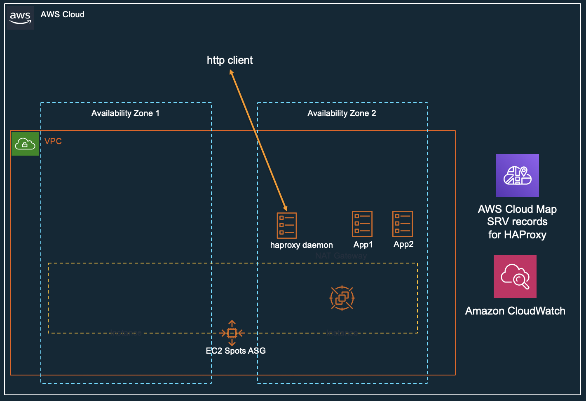

# One node ECS cluster using Spot Instance 
This will deploy a single node ECS with t3a.micro, in us-east-2 (Ohio), this will give you ~USD $2 for 2vcpu/1Gib.
ECS Tasks will use AWS Cloud Map for service discovery while Ha Proxy provides the load balancing.



## Install
```bash

git clone https://github.com/enghwa/OneNodeEcs.git
cd OneNodeEcs
npm install
export AWS_DEFAULT_REGION=us-east-2  # or any of your favourite region, but take note if the t3a.micro spot price
npx cdk@1.15.0 bootstrap
npx cdk@1.15.0 deploy

```

Once all the resources are deploy (monitor this using AWS Cloudformation dashboard), you can use your browser to test:

```
http://<public IP of EC2>/  --> nyant cat
http://<public IP of EC2>/nginx  --> load balanced 2 nginx tasks
```

## Remove

```bash
npx cdk@1.15.0 destroy
```